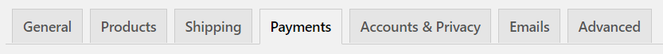
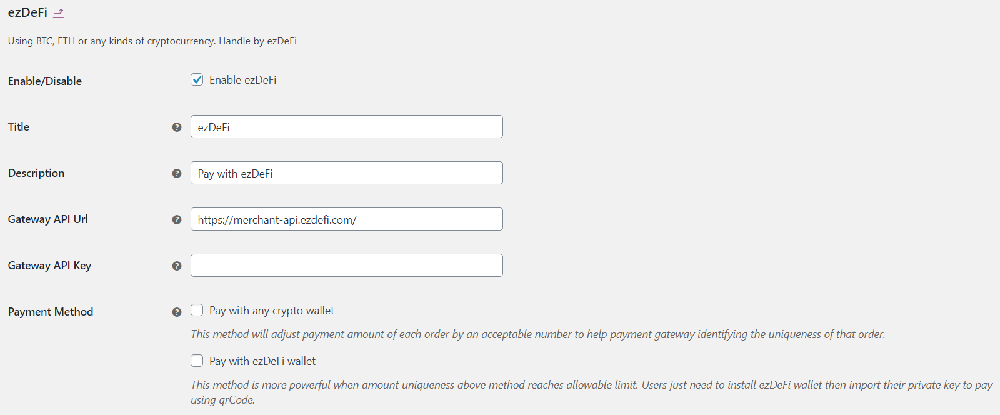

# How To
The beginning of an awesome article...

## Wordpress
For Wordpress users, you can follow the instruction below to install ezDeFi Gateway into your existing shopping cart plugin:

*WooCommerce is used as an example for this guide*

Go to your Wordpress Dashboard –> Plugins, then Add New

Now you can see the window for add new plugin appears

Choose Upload Plugin to upload and install ezDeFi plugin after downloading from ezDeFi Plugins page

Or find name of the plugin + ezdefi in the Search Bar, and install directly from Wordpress Plugin Directory

After ezDeFi plugin is successfully installed, you can find it under the existing plugin tab

Go to Settings –> Payments

Scroll down so you can find ezDeFi, click on the switch to activate ezDeFi if you haven’t done so when you first installed the plugin, then go to Manage

Now the interface for ezDeFi Manage appears, you need to complete the API Url and API Key. The API Key can be retrieved from your merchant account you have registered on ezDeFi Homepage, while the API Url is automatically configured.

> Notice:
> Remember to check Pay with any wallet and/or ezDeFi Wallet 

After having filled the API Url and API Key, you need to insert your preferred cryptocurrency for payment, and your Wallet Address, Discount, Expiration, Block Confirmation and Decimal.

Save changes. You have successfully integrated ezDeFi Gateway into your business!

## Others
For merchants who don't use Wordpress, please refer to [My platform is not supported](https://docs.ezdefi.com/p/docs/gh/ezdefi-docs/docs/docs/My%20platform%20is%20not%20supported/1.introduction.md) for more details.
