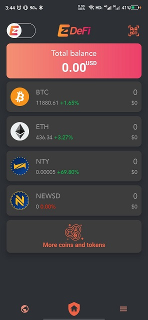

# Home

EzDeFi Wallet is a wallet application made for managing multiple cryptocurrencies. EzDeFi Wallet is currently available on Google Play Store and App Store.

## Installation

To install EzDeFi Wallet, go to:

* [Google Play Store](https://play.google.com/store/apps/details?id=com.ezdefi)

* [App Store](https://apps.apple.com/vn/app/ezdefi-crypto-bitcoin-wallet/id1492046549)

## Create a New Wallet

After installing, you will be taken to the main interface, which should have 4 coins available by default: BTC, ETH, NTY. NEWSD.

To add another coin, tap on **More Coins and Tokens**

A list of many coins and tokens appear, and you can tap on the green plus button, then select between **New**, **Exist address**, and **Import** to add it to the list.

For every coin/token in EzDeFi Wallet, a wallet was created automatically when it was added to the main wallet.

## Import Existed Wallet

To import your wallet, tap on **New address**, then **Import**

You can select 1 of 3 options to import your existing wallet:

* *Private Key*: you need to have your private key ready and paste it or turn it into a QR code and scan it, before **Import**.

* *Phrase recovery*: some coins might ask you to set up mnemonic after you have 
created your wallet. If you have it ready, paste or scan it to **Import**

* *Read only address*: You only need the address of the wallet you are going to import when you use this method. This only allows you to view the history of the transaction