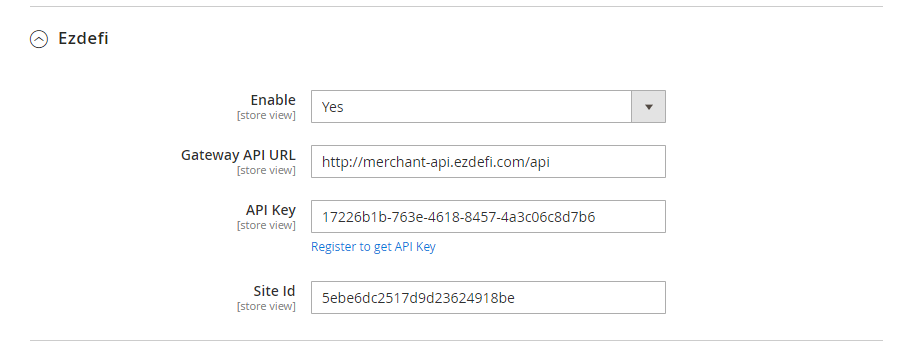
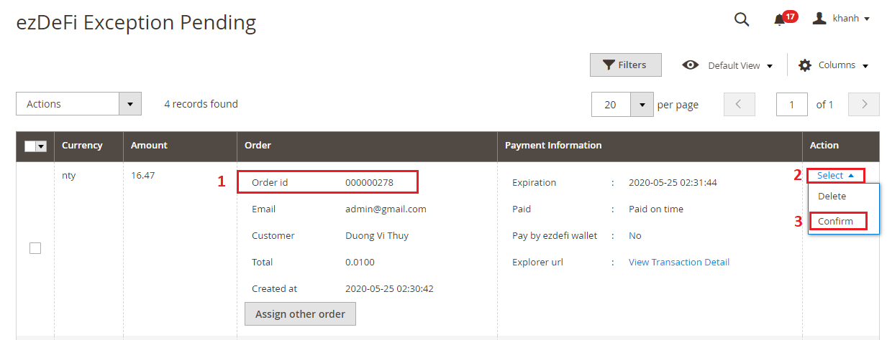
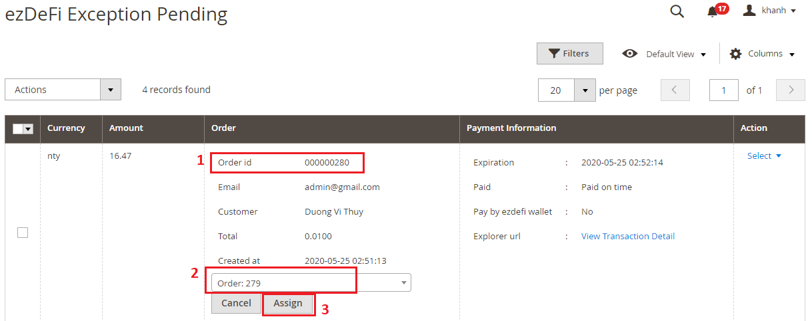
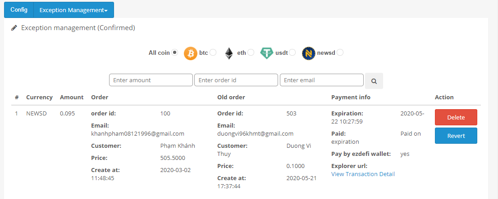
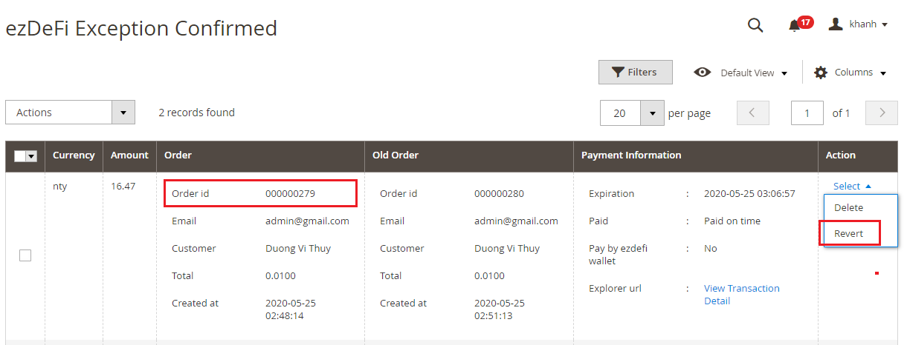
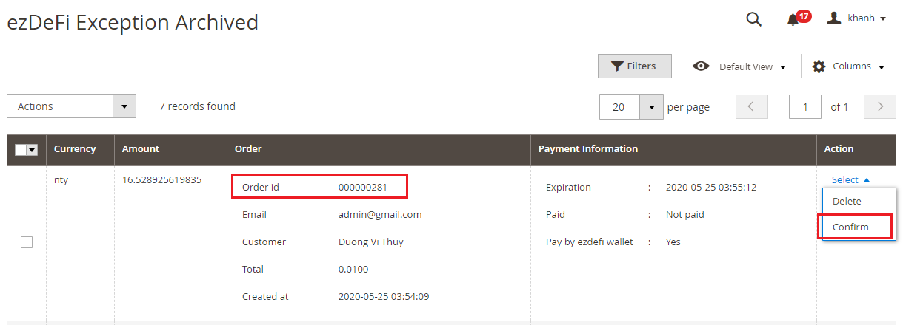
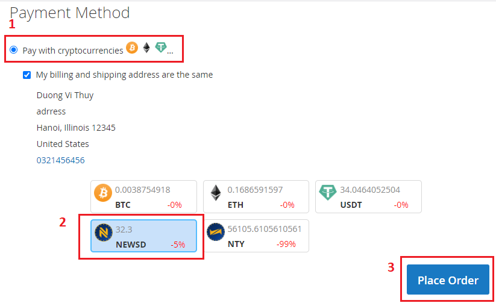
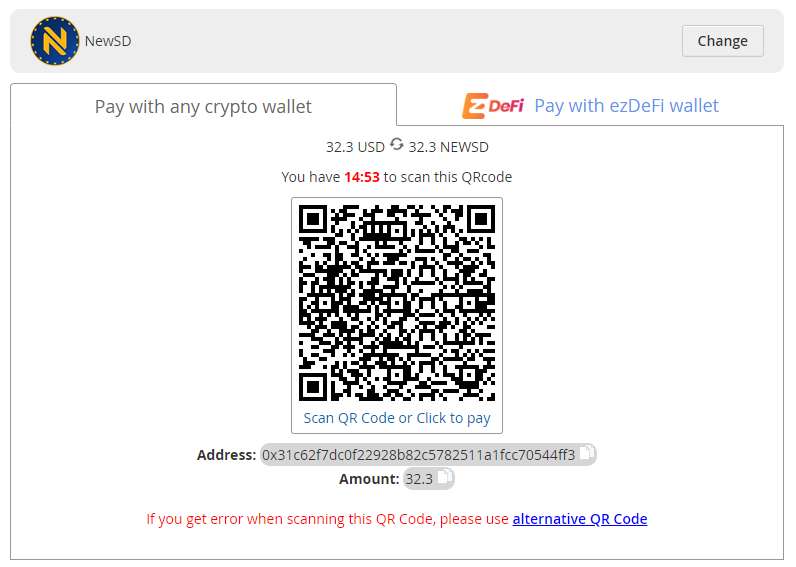
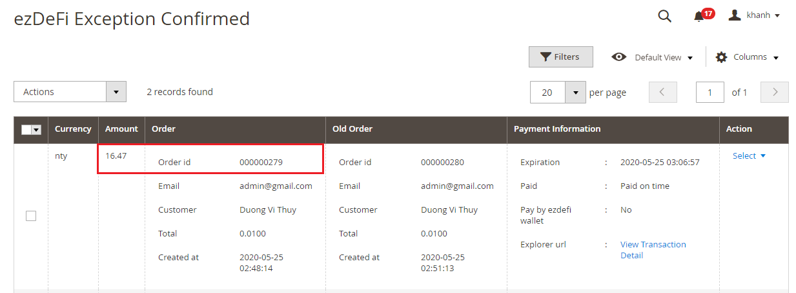

# Magento

<!--
type: tab
title: Magento 1 
-->
### EzDeFi Plugin for Magento Installation Guide

Please make sure that you have the ezDeFi plugin file for Magento  . In case you don’t, click on the link below to download the file and install:

To install ezDeFi plugin, go to **Extensions** -> **Installer** -> **Upload**, and upload the ezDeFi plugin setup file. After the file has been successfully uploaded, it will display this message:

Then you go to **Extensions**, select **Payments** in the listbox in **Choose the extension type**. Scroll down, click on the Green Plus button in ezDeFi Plugin to complete the installation.

### EzDeFi Configuration Guide

First, you need to register for a merchant account on ezDeFi homepage:

[ezDeFi Merchant Registration](https://merchant.ezdefi.com/register?utm_source=docs)

After registering for an account on ezDeFi Gateway, you can configure ezDeFi Plugin in [Sites management](https://docs.ezdefi.com/docs/docs/docs/Integrations/1.sites-management.md). Please make sure that your account on ezDeFi is ready, then move on to the next steps.

* **Enable/Disable**: Turn On/Off ezDeFi Plugin on your store interface. This field allows ezDeFi to be the payment method for your customer.

* **Gateway API Url**: Equal to Gateway Endpoint. This field is automatically configured.

* **API Key**: The API Key of the account you registered on ezDeFi homepage. Go to your ezDeFi merchant account and paste it into this field.

* **Site ID**: **Site ID** can be retrieved from your merchant account you have registered on [ezDeFi Gateways](https://merchant.ezdefi.com/register?utm_source=docs)

### Manage Exception for ezDeFi Plugin

Exception management helps the merchant to handle order issues and other related problems.

Click on **Exception Management**

In version 2.0, ezDeFi updated the exception management settings. Exception management is divided into: **Pending**, **Confirmed**, **Archived**.

#### Pending

In the Pending tab, paid orders are saved under status *Paid on time*, *Paid after expired*, and orders that are paid with odd amount. Each order is attached with paid amount and link to its corresponding transaction.

* Confirm order: Select the Order you want to confirm, then **Confirm paid**

After confirmed, order 503 will be transfered to **Confirmed** tab

* Assign order: When customers generate identical QR Code, and you need to assign the right order to the paid customer, click on **Choose order to assign** -> enter orderID -> **Assign**

After the order is assigned, *Amount* and new *OrderID* is displayed in **Confirmed** tab

#### Confirmed

Save the confirmed order from **Pending** and **Archived**

Revert order: Select the order you want to revert -> **Revert**

#### Archived

Save all the *Amount* of all the unpaid invoice, or paid invoice that have trouble with receiving payment.

* Confirm invoice: Select *OrderID* -> **Confirm Paid**

### EzDeFi Payment

Step 1: Select *Pay with cryptocurrencies*

Step 2: Select the coin/token for payment

Step 3: Click **Next** to move to the final step

Step 4: The system will display the QR Code

* If you use wallet other than ezDeFi Wallet, please select **Pay with any crypto wallet** and enter the right amount on the QR Code to complete the payment.

* If you use ezDeFi Wallet, please select **Pay with ezDeFi wallet** to complete the payment.

> **Notice:** 
>
> (On the QR code screen, you can switch to different coin/token to pay by clicking on **Change** button -> Select different coin/token)
>
> With *Pay with any crypto wallet*, if customers have trouble with QR Code, click on *alternative QR Code* to scan QR Code only.
> 
> We recommend ***[ezDeFi Wallet](https://ezdefi.com/wallet/)*** for smoother and easier checkout.

<!--
type: tab
title: Magento 2 
-->

### EzDeFi Plugin for Magento Installation Guide

Please make sure that you have the ezDeFi plugin file for Magento  . In case you don’t, click on the link below to download the file and install:

To install ezDeFi plugin, go to **Extensions** -> **Installer** -> **Upload**, and upload the ezDeFi plugin setup file. After the file has been successfully uploaded, it will display this message:

Then you go to **Extensions**, select **Payments** in the listbox in **Choose the extension type**. Scroll down, click on the Green Plus button in ezDeFi Plugin to complete the installation.

### EzDeFi Configuration Guide

First, you need to register for a merchant account on ezDeFi homepage:

[ezDeFi Merchant Registration](https://merchant.ezdefi.com/register?utm_source=docs)

After registering for an account on ezDeFi Gateway, you can configure ezDeFi Plugin in [Sites management](https://docs.ezdefi.com/docs/docs/docs/Integrations/1.sites-management.md). Please make sure that your account on ezDeFi is ready, then move on to the next steps.

* **Enable/Disable**: Turn On/Off ezDeFi Plugin on your store interface. This field allows ezDeFi to be the payment method for your customer.

* **Gateway API Url**: Equal to Gateway Endpoint. This field is automatically configured.

* **API Key**: The API Key of the account you registered on ezDeFi homepage. Go to your ezDeFi merchant account and paste it into this field.

* **Site ID**: **Site ID** can be retrieved from your merchant account you have registered on [ezDeFi Gateways](https://merchant.ezdefi.com/register?utm_source=docs)

### Manage Exception for ezDeFi Plugin

Exception management helps the merchant to handle order issues and other related problems.

Click on **Exception Management**

In version 2.0, ezDeFi updated the exception management settings. Exception management is divided into: **Pending**, **Confirmed**, **Archived**.

#### Pending

In the Pending tab, paid orders are saved under status *Paid on time*, *Paid after expired*, and orders that are paid with odd amount. Each order is attached with paid amount and link to its corresponding transaction.

* Confirm order: Select the Order you want to confirm, then **Confirm paid**

After confirmed, order 503 will be transfered to **Confirmed** tab

* Assign order: When customers generate identical QR Code, and you need to assign the right order to the paid customer, click on **Choose order to assign** -> enter orderID -> **Assign**

After the order is assigned, *Amount* and new *OrderID* is displayed in **Confirmed** tab

#### Confirmed

Save the confirmed order from **Pending** and **Archived**

Revert order: Select the order you want to revert -> **Revert**

#### Archived

Save all the *Amount* of all the unpaid invoice, or paid invoice that have trouble with receiving payment.

* Confirm invoice: Select *OrderID* -> **Confirm Paid**

### EzDeFi Payment

Step 1: Select *Pay with cryptocurrencies*

Step 2: Select the coin/token for payment

Step 3: Click **Next** to move to the final step

Step 4: The system will display the QR Code

* If you use wallet other than ezDeFi Wallet, please select **Pay with any crypto wallet** and enter the right amount on the QR Code to complete the payment.

* If you use ezDeFi Wallet, please select **Pay with ezDeFi wallet** to complete the payment.

> **Notice:** 
>
> (On the QR code screen, you can switch to different coin/token to pay by clicking on **Change** button -> Select different coin/token)
>
> With *Pay with any crypto wallet*, if customers have trouble with QR Code, click on *alternative QR Code* to scan QR Code only.
> 
> We recommend ***[ezDeFi Wallet](https://ezdefi.com/wallet/)*** for smoother and easier checkout.
<!--type: tab-end -->
