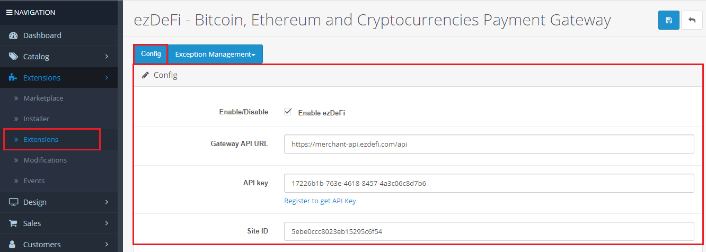
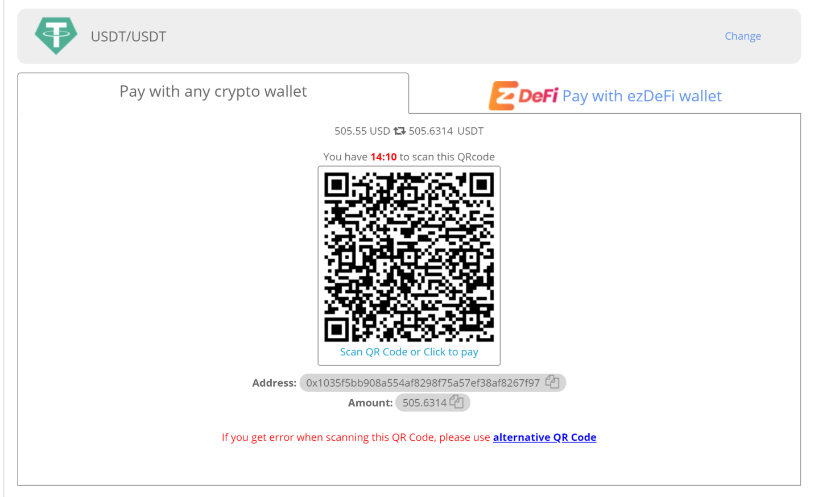
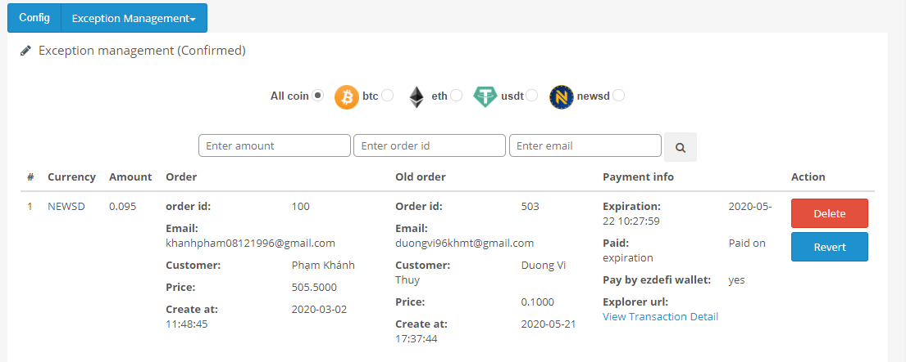

# OpenCart
1. EzDeFi Plugin for OpenCart Installation Guide

Please make sure that you have the EzDeFi plugin file for OpenCart. In case you don’t, click on the link below to download the file and install:

[OpenCart Marketplace](https://www.opencart.com/index.php?route=marketplace/extension/info&extension_id=38282&filter_search=ezdefi)

To install EzDeFi plugin, go to **Extensions** -> **Installer** -> **Upload**, and upload the EzDeFi plugin setup file. After the file has been successfully uploaded, it will display this message:

Then you go to **Extensions**, select **Payments** in the listbox in **Choose the extension type**. Scroll down, click on the Green Plus button in EzDeFi Plugin to complete the installation.

After installation completed, the *Green Plus* button will change into *Red Minus* button. Now you can configure the settings of EzDeFi Plugin by clicking on the *Blue Pen* button.

2. EzDeFi Configuration Guide

First, you need to register for a merchant account on EzDeFi homepage:

[EzDeFi Merchant Registration](https://merchant.ezdefi.com/register?utm_source=docs)

After registering for an account on EzDeFi Gateway, you can configure EzDeFi Plugin. Please make sure that your account on EzDeFi is ready, then move on to the next steps.

I. **Enable/Disable**: Turn On/Off EzDeFi Plugin on your store interface. This field allows EzDeFi to be the payment method for your customer.

II. **Title**: Change the name of the payment method on your store interface.

III. **Description**: Add description for this payment method in the textbox.

IV. **Gateway API Url**: Equal to Gateway Endpoint. This field is automatically configured.

V. **Gateway API Key**: The API Key of the account you registered on EzDeFi homepage. Go to your EzDeFi merchant account and paste it into this field.

VI. **Payment method**.

EzDeFi supports payment for customers using EzDeFi Wallet and also the customers who prefer their wallet of choice.
* **Pay with any crypto wallet**: is the payment method for customers who prefer to use their wallets of choice.

For this payment method to function properly, you need to set **Acceptable price variation** and **Decimal** (for each coin/token)

**Acceptable price variation**: Enter the acceptable fluctuation rate to generate the difference in price with the total price of the Order.

> **Notice:**
> 1. If the number of orders at one moment is too large  and the value of each order is similar, the **Acceptable price variation** should be > 1%.
> 2. If your product price is low, the recommended **Acceptable price variation** is between 2 - 5%.

**Decimal**: Set decimal for all the accepted cryptocurrency in your store.

> **Notice:** 
> 
> With coin/token that has big value like BTC, ETH, etc., the decimal should be more or equal to 8.

* **Pay with EzDeFi wallet**: is the payment method for customers who use EzDeFi Wallet.

VII. **Accepted Currency**: Setup the cryptocurrency that are allowed in your store.

Initially, EzDeFi automatically includes NewSD, Bitcoin, and Ethereum. You can add more coin/token by clicking on **Add more**.

The Coin config interface will add another field below, enter the currency that you want to add in Name to find coin/token.

We have a list of our supported coins/tokens. If we don't have your coin/token in this list, please fill out the form at [Supported Coins/Tokens](https://ezdefi.com/news/supported-coins-tokens/)

* **Discount**: Enter the discount percentage for each coin/token.
* **Expiration (seconds)**: Enter the time for checkout before it expires.
* **Wallet address**: Enter the wallet address to receive coin/token payment.
* **Block confirmation**: The number of blocks that you want to record customer’s transaction and confirm the transaction.

> **Notice:** 
> 
> With coin/token that has large value i.e. BTC, ETH, etc., you should enter big enough number, but the downside is that confirming customers’ transactions would take more time.

VIII. **Save Changes**

Finally, don’t forget to save your configs.

Below is the completed example of EzDeFi plugin setup:

3. EzDeFi Payment Guide

Step 1: Select **Pay with cryptocurrencies** method

Step 2: Confirm I have read and agreed to the *Terms & Conditions*, then click on **Continue**.

Step 3: Select the preferred coin/token payment

Step 4: Click on **Next** button

Now the system will display the QR Code, if you use wallet other than EzDeFi Wallet, please select **Pay with any crypto currency wallet** and enter the right amount on the QR Code to complete the payment. Otherwise, if you use EzDeFi Wallet, please select **Pay with EzDeFi wallet** to complete the payment.

> **Notice:** 
> 
> We recommend *EzDeFi Wallet* for smoother and easier checkout.

You can change coin/token to pay by clicking on other coin/token buttons, then continue with Step 4.

4. Processing Orders Paying after the QR Code Expires (For merchant)

Click on **EzDeFi exception management**

In EzDeFi exception management, **Exception** is the record of the amount corresponding with each order. Customer’s QR code generation and amount is stored in EzDeFi exception table. This will help the merchant to handle order issues and other related problems.

I. Confirm order:

Select the valid order, then click on **Confirm Paid** button.

II. Change the order status from **Paid** to **Not paid**

Select the order you want to change, click **Revert** button.

III. Assign amount doesn’t belong to any order

E.g: Your customer uses **Pay with any crypto currency**, but doesn’t enter the exact amount displayed in QR Code. You can go to **EzDeFi exception** to find the amount that customers paid, click on **OrderID** to find the order you want to confirm, then click on **Confirm Paid** to complete the order.

IV. Choose order to assign

You can assign each amount for any order you want, or you can create a new order and assign the amount for it.
Sequence: Click on **Choose order to assign** -> Select 1 order -> Click on **Assign**.

> **Notice:**
>
> **AmountId** is the unique payment amount, generated each time the order is refreshed on the checkout page by changing a very small amount of the total price of the order, to identify the order that has the same **OrderId**. After the plugin received the **AmountId** of the completed order, it'll send back to the merchant the information of that order so the merchant will know which order did the customer pay for.

V. Search

**EzDeFi exception management** supports search based on **Amount**, **OrderID**, **Currency**, or **Email**.