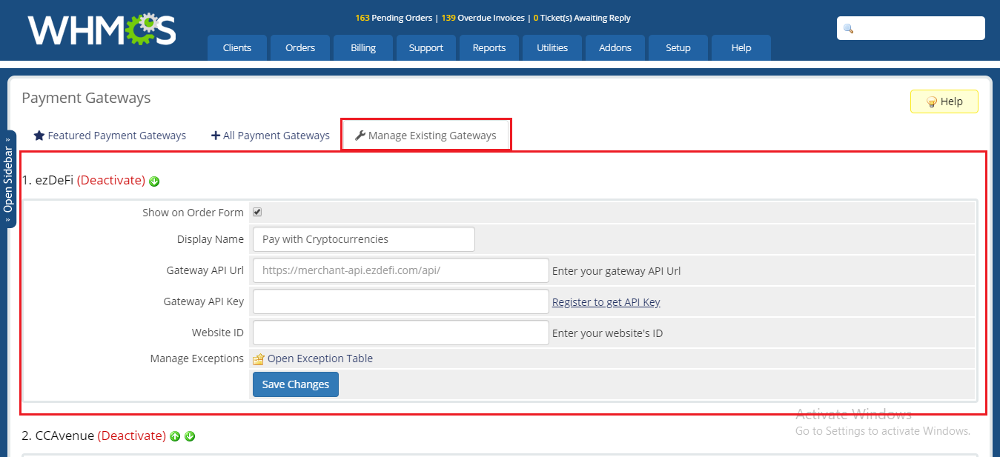

# WHMCS

### EzDeFi Plugin for WHMCS Installation

Please make sure that you have the ezDeFi plugin file for WHMCS. In case you don’t, click on the link below to download the file and install:

[WHMCS Marketplace](https://marketplace.whmcs.com/product/5231)

After you have your installation file, copy the files from the downloaded folder to the root of your WHMCS server.
> **Notice**:
>
> Please make sure you copy the files from the plugin folder into the root folder.

To install ezDeFi plugin, go to **Setup** -> **Payment** -> **Payment Gateway**, and upload the ezDeFi plugin setup file.

Then under **All Payment Gateways** tab, click on **ezDeFi** and your plugin is activated!

After installation completed, click on **Manage Existing Gateways**.

### EzDeFi Plugin Configuration

First, you need to register for a merchant account on ezDeFi homepage:

[ezDeFi Merchant Registration](https://merchant.ezdefi.com/register?utm_source=docs)

After registering for an account on ezDeFi, you can configure ezDeFi Plugin. Please make sure that your account on ezDeFi is ready, then move on to the next steps.

I. **Show on Order Form**: Turn On/Off ezDeFi Plugin on your store interface. This checkbox allows ezDeFi to be the payment method for your customer.

II. **Display Name**: Change the name of the payment method on your store interface.

III. **Gateway API Url**: Equal to Gateway Endpoint. This field is automatically configured.

IV. **Gateway API Key**: The API Key of the account you registered on ezDeFi homepage. Go to your ezDeFi merchant account and paste it into this field.

V. **Website ID**: Generated after you have added your website on [merchant.ezdefi.com](https://merchant.ezdefi.com/). Go to **Sites management** -> *Your site* to view your Website ID

VI. **Manage Exception**: Use to manage exception for orders that have issues.  

Finally, don’t forget to **Save Changes**.

### Manage Exception for ezDeFi Plugin

Exception management helps the merchant to handle order issues and other related problems.

Click on **Open Exception Table**

In version 2.0, ezDeFi updated the exception management settings. Exception management is divided into: **Pending**, **Confirmed**, **Archived**.

#### Pending

In the Pending tab, paid orders are saved under status *Paid on time*, *Paid after expired*, and orders that are paid with odd amount. Each invoice is attached with paid amount and link to its corresponding transaction.

* Confirm invoice: Select the Invoice you want to confirm, then **Confirm paid**

After confirmed, order #168 will be transfered to **Confirmed** tab

* Assign invoice: When customers generate identical QR Code, and you need to assign the right order to the paid customer, click on **Assign to different invoice** -> enter invoice ID -> **Confirm paid**

After the order is assigned, *Received Amount* and new *InvoiceID* is displayed in **Confirmed** tab

#### Confirmed

Save the confirmed invoice from **Pending** and **Archived**

Reverse invoice: Select the invoice you want to reverse -> **Reverse**

#### Archived

Save all the *Received Amount* of all the unpaid invoice, or paid invoice that have trouble with receiving payment.

* Confirm invoice: Select *InvoiceID* -> **Confirm paid**

### EzDeFi Payment

Step 1: Select ezDeFi Payment method, click **Complete Order**

Step 2: The system will display QR Code, it will select the first coin/token by default.

Step 3: Select the preferred payment wallet

* If you use wallet other than ezDeFi Wallet, please select **Pay with any crypto currency wallet** and enter the right amount on the QR Code to complete the payment.

* If you use ezDeFi Wallet, please select **Pay with ezDeFi wallet** to complete the payment.

> **Notice:** 
>
> With *Pay with any crypto currency wallet*, if customers have trouble with QR Code, click on *alternative QR Code* to scan QR Code only.
> 
> We recommend ***[ezDeFi Wallet](https://ezdefi.com/wallet/)*** for smoother and easier checkout.
