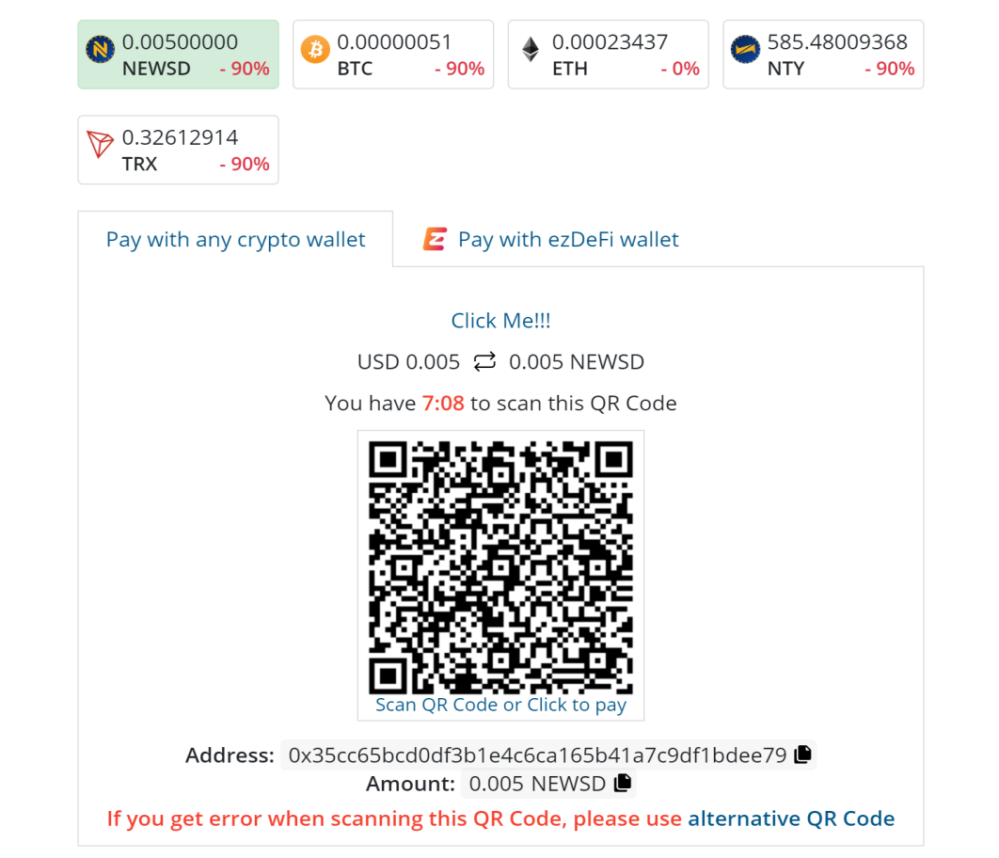

# WooCommerce

### EzDeFi Plugin for EDD Installation

There are several ways to install ezDeFi Plugin into WooCommerce.

For Wordpress users, you can follow the instruction below to install ezDeFi Gateway into your existing shopping cart plugin:

1. Go to your Wordpress **Dashboard** --> **Plugins**, then **Add New**

 

2. Now you can see the window for add new plugin appears

* Choose **Upload Plugin** to upload and install ezDeFi plugin after downloading from ezDeFi Plugins page

* Or find *name of the plugin + ezdefi* in the Search Bar, and install directly from Wordpress Plugin Directory

3. Click on **Install Now**, then **Activate Plugin** to complete the installation.

After activating ezDeFi Plugin, you will be redirected to plugin management. In this interface, you can view **Installed plugins**, **Activate**, **Deactivate**, or **Delete** the plugins.

### EzDeFi Plugin Configuration

1. After ezDeFi plugin is successfully installed, you can find it under the existing plugin tab

2. Go to **Settings** -> **Payments**

3. Scroll down so you can find ezDeFi, click on the switch to activate ezDeFi if you haven't done so when you first installed the plugin, then go to **Manage**

4. Now the interface for ezDeFi **Manage** appears, you need to fill in the **API Url**, **API Key**, and **Site ID**.

* **Enable/Disable**: Turn On/Off ezDeFi Plugin on your store interface. This field allows ezDeFi to be the payment method for your customer.

* **Title**: Display the name for this payment method.

* **Description**: Describe the name for this payment method.

* **API Url**: Equal to Gateway Endpoint. This field is automatically configured.

* **API Key**: The API Key of the account you registered on ezDeFi homepage. Go to your ezDeFi merchant account and paste it into this field.

* **Site ID**: Site ID can be retrieved from your merchant account you have registered on ezDeFi Gateways

* **Order status**: Status for orders that have been paid. 

> **Notice**: 
>
> **API Url** is automatically filled for you, if not, please enter https://merchant-api.ezdefi.com/api/

5. **Save changes**

You have successfully integrated ezDeFi into your business.

### Manage Exception for ezDeFi Plugin

Exception management helps the merchant to handle order issues and other related problems.

In Wordpress interface, go to Dashboard -> Downloads -> Exception management -> ezDeFi Exception.

In version 2.0, ezDeFi updated the exception management settings. Exception management is divided into: **Pending**, **Confirmed**, **Archived**.

#### Pending

In the Pending tab, paid orders are saved under status *Paid on time*, *Paid after expired*, and orders that are paid with odd amount. Each order is attached with paid amount and link to its corresponding transaction.

* Confirm order: Select the Order you want to confirm, then **Confirm paid**

After confirmed, order 1153 will be transfered to **Confirmed** tab

* Assign order: When customers generate identical QR Code, and you need to assign the right order to the paid customer, click on **Assign to different order** -> enter orderID -> **Confirm paid**

After the order is assigned, *Received Amount* and new *OrderID* is displayed in **Confirmed** tab

#### Confirmed

Save the confirmed invoice from **Pending** and **Archived**

Reverse invoice: Select the invoice you want to reverse -> **Reverse**

#### Archived

Save all the *Received Amount* of all the unpaid invoice, or paid invoice that have trouble with receiving payment.

* Confirm invoice: Select *OrderID* -> **Confirm paid**

### EzDeFi Payment

Step 1: Select ezDeFi Payment method, click **Purchase**

Step 2: The system will display QR Code, it will select the first coin/token by default.

Step 3: Select the preferred payment wallet

* If you use wallet other than ezDeFi Wallet, please select **Pay with any crypto currency wallet** and enter the right amount on the QR Code to complete the payment.

* If you use ezDeFi Wallet, please select **Pay with ezDeFi wallet** to complete the payment.

> **Notice:** 
>
> With *Pay with any crypto currency wallet*, if customers have trouble with QR Code, click on *alternative QR Code* to scan QR Code only.
> 
> We recommend ***[ezDeFi Wallet](https://ezdefi.com/wallet/)*** for smoother and easier checkout.
