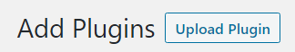

# Easy Digital Downloads
There are several ways to install ezDeFi Plugin into EasyDigitalDownloads.

For Wordpress users, you can follow the instruction below to install ezDeFi Gateway into your existing shopping cart plugin:

1. Go to your Wordpress **Dashboard** --> **Plugins**, then **Add New**

 

2. Now you can see the window for **Add New** plugin appears

* Choose **Upload Plugin** to upload and install ezDeFi plugin after downloading from ezDeFi Plugins page

* Or find *name of the plugin + ezdefi* in the Search Bar, and install directly from Wordpress Plugin Directory

3. Click on **Install Now**, then **Activate** plugin to complete the installation.

4. After **Activate** plugin, please go to **Download** -> **Settings** -> select **Payment Gateways** -> click on **ezDeFi**

> **Notice:**
> * You need to sign-up for a merchant account on [ezDeFi Gateway](https://merchant.ezdefi.com/)
> * After completed the registration, you can configure ezDeFi plugin on Easy Digital Downloads

5. Fill in the **API Url** and **API Key**. The **API Key** can be retrieved from your merchant account you have registered on [ezDeFi Gateways](https://merchant.ezdefi.com/)

> **Notice**:
>
> **API Url** is automatically filled for you, if not, please enter https://merchant-api.ezdefi.com/api/

6. Check your preferred wallet to receive payment in **Payment Method**

* **Pay with any crypto wallet**: is the payment method for customers who prefer to use their wallets of choice.

For this payment method to function properly, you need to set **Acceptable price variation** and **Decimal** (for each coin/token)

**Acceptable price variation**: Enter the acceptable fluctuation rate to generate the difference in price with the total price of the Order.

> **Notice:**
> 1. If the number of orders at one moment is too large  and the value of each order is similar, the **Acceptable price variation** should be > 1%.
> 2. If your product price is low, the recommended **Acceptable price variation** is between 2 - 5%.

**Decimal**: Set decimal for all the accepted cryptocurrency in your store.

> **Notice:** 
> 
> With coin/token that has big value like BTC, ETH, etc., the decimal should be more or equal to 8.

* **Pay with ezDeFi wallet**: is the payment method for customers who use ezDeFi Wallet.

7. Then you need to insert your preferred cryptocurrency for payment, and your **Wallet Address**, **Discount**, **Expiration**, **Block Confirmation** and **Decimal**.

> **Notice:**
> * With coin/token that has big value like BTC, ETH, etc., the decimal should be more or equal to 8.
> * As **Block Confirmation** number is bigger, it's more secure for the transaction, but the confirmation time will get longer for the customer.
> * **Add Currency** button gives customers more choice while paying with cryptoccurency. Click on the button, then search for the cryptoccurency you want.

We have a list of our supported coins/tokens. If we don't have your coin/token in this list, please fill out the form at [Supported Coins/Tokens](https://ezdefi.com/news/supported-coins-tokens/)

8. **Save Changes**

You have successfully integrated ezDeFi into your business.
