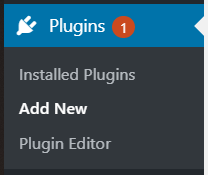
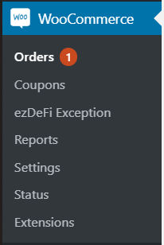

# WooCommerce
There are several ways to install ezDeFi Plugin into WooCommerce.

For Wordpress users, you can follow the instruction below to install ezDeFi Gateway into your existing shopping cart plugin:

1. Go to your Wordpress **Dashboard** --> **Plugins**, then **Add New**

 

2. Now you can see the window for add new plugin appears

* Choose **Upload Plugin** to upload and install ezDeFi plugin after downloading from ezDeFi Plugins page

* Or find *name of the plugin + ezdefi* in the Search Bar, and install directly from Wordpress Plugin Directory

Click on **Install Now**, then **Activate Plugin** to complete the installation.

After activating ezDeFi Plugin, you will be redirected to plugin management. In this interface, you can view **Installed plugins**, **Activate**, **Deactivate**, or **Delete** the plugins.

3. After ezDeFi plugin is successfully installed, you can find it under the existing plugin tab

4. Go to **Settings** -> **Payments**

5. Scroll down so you can find ezDeFi, click on the switch to activate ezDeFi if you haven't done so when you first installed the plugin, then go to **Manage**

6. Now the interface for ezDeFi **Manage** appears, you need to complete the **API Url** and **API Key**. The API Key can be retrieved from your merchant account you have registered on [ezDeFi Homepage](https://ezdefi.com/)

7. After having filled the **API Url** and **API Key**, you need to insert your preferred cryptocurrency for payment, and your **Wallet Address**, **Discount**, **Expiration**, **Block Confirmation** and **Decimal**.

> **Notice:**
> * With coin/token that has big value like BTC, ETH, etc., the decimal should be more or equal to 8.
> * As **Block Confirmation** number is bigger, it's more secure for the transaction, but the confirmation time will get longer for the customer.

8. Save changes.

You have successfully integrated ezDeFi into your business.

