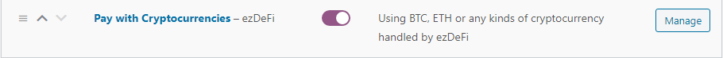
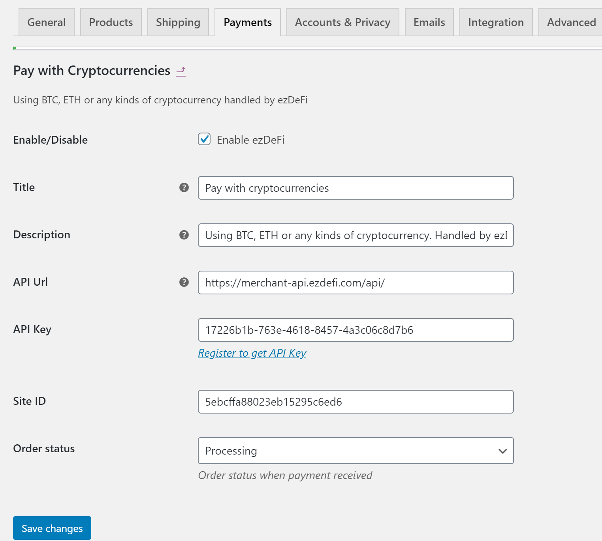

# WooCommerce
There are several ways to install ezDeFi Plugin into WooCommerce.

For Wordpress users, you can follow the instruction below to install ezDeFi Gateway into your existing shopping cart plugin:

1. Go to your Wordpress **Dashboard** --> **Plugins**, then **Add New**

 

2. Now you can see the window for add new plugin appears

* Choose **Upload Plugin** to upload and install ezDeFi plugin after downloading from ezDeFi Plugins page

* Or find *name of the plugin + ezdefi* in the Search Bar, and install directly from Wordpress Plugin Directory

Click on **Install Now**, then **Activate Plugin** to complete the installation.

After activating ezDeFi Plugin, you will be redirected to plugin management. In this interface, you can view **Installed plugins**, **Activate**, **Deactivate**, or **Delete** the plugins.

3. After ezDeFi plugin is successfully installed, you can find it under the existing plugin tab

4. Go to **Settings** -> **Payments**

5. Scroll down so you can find ezDeFi, click on the switch to activate ezDeFi if you haven't done so when you first installed the plugin, then go to **Manage**

6. Now the interface for ezDeFi **Manage** appears, you need to complete the **API Url** and **API Key**. The API Key can be retrieved from your merchant account you have registered on [ezDeFi Homepage](https://ezdefi.com/)

> **Notice**:
>
> **API Url** is automatically filled for you, if not, please enter https://merchant-api.ezdefi.com/api/

7. Check **Pay with any crypto wallet** and/or **Pay with ezDeFi wallet** to indicate your customer payment method.

* **Pay with any crypto wallet**: is the payment method for customers who prefer to use their wallet of choice.

For this payment method to function properly, you need to set **Acceptable price variation** and **Decimal** (for each coin/token)

**Acceptable price variation**: Enter the acceptable fluctuation rate to generate the difference in price with the total price of the Order.

> **Notice:**
> 1. If the number of orders at one moment is too large  and the value of each order is similar, the **Acceptable price variation** should be > 1%.
> 2. If your product price is low, the recommended **Acceptable price variation** is between 2 - 5%.

**Decimal**: Set decimal for all the accepted cryptocurrency in your store.

> **Notice:** 
> 
> With coin/token that has big value like BTC, ETH, etc., the decimal should be more or equal to 8.

* **Pay with ezDeFi wallet**: is the payment method for customers who prefer to use their wallets of choice.

8. After having filled the **API Url** and **API Key**, you need to insert your preferred cryptocurrency for payment, and your **Wallet Address**, **Discount**, **Expiration**, **Block Confirmation** and **Decimal**.

> **Notice:**
> * With coin/token that has big value like BTC, ETH, etc., the decimal should be more or equal to 8.
> * As **Block Confirmation** number is bigger, it's more secure for the transaction, but the confirmation time will get longer for the customer.
> * **Add Currency** button gives customers more choice while paying with cryptoccurency. Click on the button, then search for the cryptoccurency you want.

We have a list of our supported coins/tokens. If we don't have your coin/token in this list, please fill out the form at [Supported Coins/Tokens](https://ezdefi.com/news/supported-coins-tokens/)

9. **Save changes**

You have successfully integrated ezDeFi into your business.